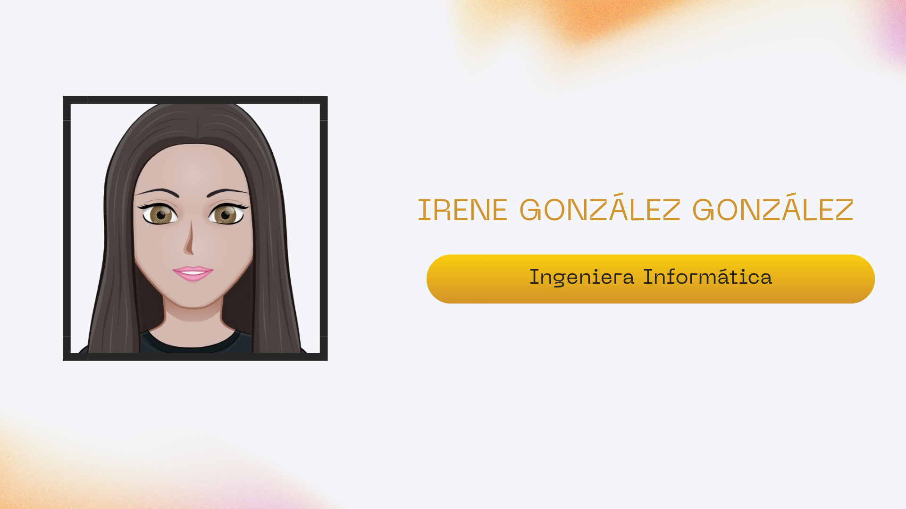

# 👋 Hola, soy Irene

  

Graduada en **Ingeniería Informática** y con  **Máster en Computación y Sistemas Inteligentes** en la **Universidad de Deusto**.  
Apasionada por **Machine Learning, Deep Learning, Visión por Computador y Deep Learning**.

---

## 💻 Tecnologías
**ML/DL:** Python, TensorFlow, Keras, Scikit-learn, Pandas, NumPy  
**Visión por computador:** OpenCV, PyTorch, YOLO  
**NLP:** spaCy, HuggingFace, GPT  
**Big Data & Cloud:** AWS, Hadoop, Spark, Docker, MongoDB  
**Web & Dev:** HTML, CSS, JavaScript, React, Next.js  
**Otros:** C/C++, Java, ROS, GitHub, Linux  

---

## 📊 GitHub Stats

---

## 📫 Contacto
- [GitHub](https://github.com/IreeneGG)  
- [LinkedIn](https://www.linkedin.com/in/irene-gonz%C3%A1lez-gonz%C3%A1lez-97344b2b7/)

